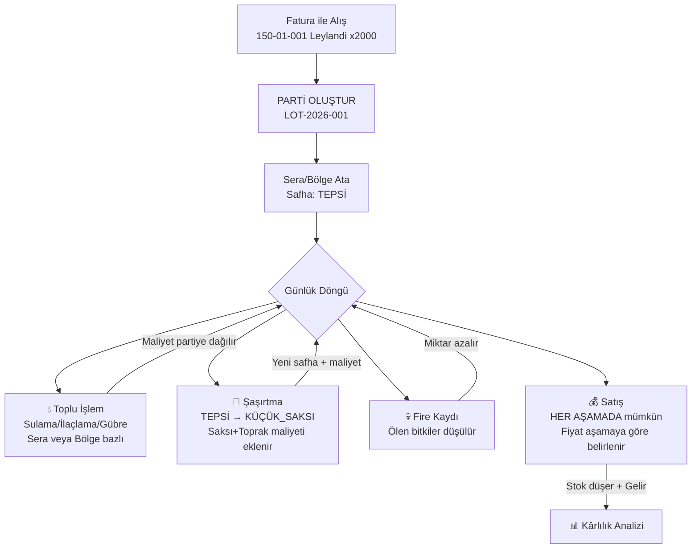
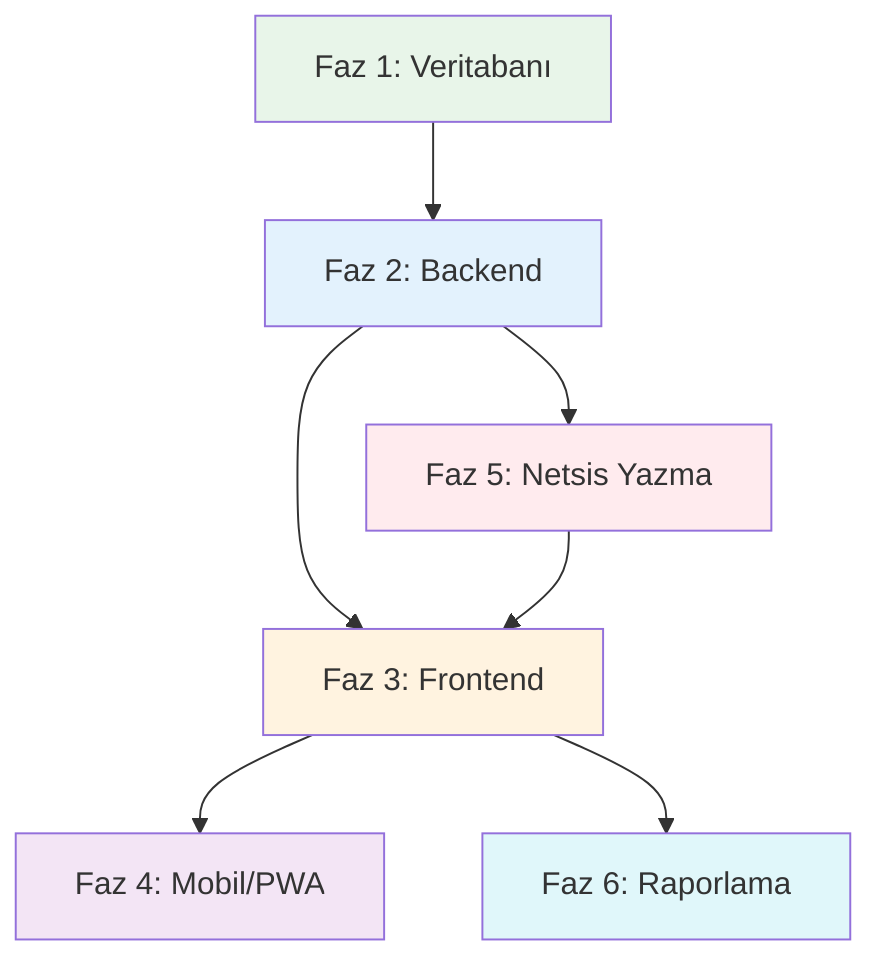

# FidanX Netsis – 2026 Kapsamlı Geliştirme Planı

**Tarih:** 26 Şubat 2026  
**Hazırlayan:** AI Geliştirme Asistanı  
**Proje:** Botanik Bahçe Yönetim Sistemi (FidanX + Netsis ERP)  
**Veritabanı:** MSSQL (Netsis Entegre + Özel FidanX Tabloları)

---

## 1. MEVCUT DURUM ANALİZİ

### 1.1 Proje Mimarisi

| Katman | Teknoloji | Durum |
|--------|-----------|-------|
| **Frontend** | Next.js (React + TypeScript) | ✅ Aktif, Premium UI |
| **Backend** | NestJS (TypeScript) | ✅ Aktif, 12 Modül |
| **Veritabanı** | MSSQL (Netsis ERP) | ✅ Aktif |
| **Özel Tablolar** | 19 adet FidanX tablosu | ✅ Aktif |
| **Mobil** | Responsive Web (PWA potansiyeli) | ⚠️ Kısmi |

### 1.2 Mevcut Backend Modülleri

| # | Modül | Dosya | Durum | Açıklama |
|---|-------|-------|-------|----------|
| 1 | **Netsis Stoklar** | `netsis/stocks/stocks.service.ts` | ✅ | TBLSTSABIT, TBLSTHAR, seri/lot takibi |
| 2 | **Netsis Faturalar** | `netsis/invoices/invoices.service.ts` | ✅ | Alış/Satış faturaları, kalem detayları |
| 3 | **Netsis Müşteriler** | `netsis/customers/` | ✅ | TBLCASABIT (120/320 kodları) |
| 4 | **Netsis Dashboard** | `netsis/dashboard/dashboard.service.ts` | ✅ | Stok özeti, kritik stoklar, top müşteriler |
| 5 | **Netsis Finans** | `netsis/finance/finance.service.ts` | ✅ | Banka, kasa, çek/senet, ödemeler |
| 6 | **Üretim** | `production/production.service.ts` | ⚠️ | Parti takibi var ama eksik (barkod, saksı geçişi yok) |
| 7 | **Satışlar** | `sales/sales.service.ts` | ⚠️ | Lokal tablo, Netsis'e yazma TODO |
| 8 | **Bitkiler** | `plants/plants.service.ts` | ⚠️ | Lokal tablo, Netsis ile çakışma riski |
| 9 | **Reçeteler** | `recipes/recipes.service.ts` | ✅ | Malzeme listesi (BOM) |
| 10 | **Finans/Giderler** | `finans/expenses.service.ts` | ⚠️ | Lokal, Netsis ile entegre değil |
| 11 | **Maliyet** | `finans/costing.service.ts` | ⚠️ | Basit hesaplama, Netsis serbest üretim yok |
| 12 | **Entegrasyon** | `integration/integration.service.ts` | ⚠️ | Sync var, pushInvoice TODO durumda |

### 1.3 Mevcut Frontend Sayfaları

| Sayfa | Yol | Durum |
|-------|-----|-------|
| Dashboard | `/` | ✅ Premium UI |
| Stoklar | `/stoklar` | ✅ Netsis entegre, gruplama, hareket |
| Satınalma | `/satinalma` | ✅ Netsis fatura listesi |
| Satışlar | `/satislar` | ⚠️ Lokal sipariş sistemi |
| Üretim | `/uretim` | ⚠️ Parti tabanlı, eksik özellikler |
| Reçeteler | `/receteler` | ✅ Çalışıyor |
| Sera | `/sera` | ✅ Sıcaklık kayıtları |
| Operasyon | `/operasyon` | ✅ Aktivite logları |
| Analizler | `/analizler` | ⚠️ Temel düzeyde |
| Raporlar | `/raporlar` | ⚠️ Kısmi veri |
| Finans | `/finans` | ✅ Netsis banka/kasa/çek |
| Firmalar | `/firmalar` | ✅ Netsis CRM |
| Scanner | `/scanner` | ❌ Mock/Simülasyon |
| Ayarlar | `/ayarlar` | ✅ |
| Destek | `/destek` | ✅ |

### 1.4 Mevcut Veritabanı Tabloları (Özel FidanX)

```
TemperatureLogs      → Sera sıcaklık ölçümleri
FertilizerLogs       → Gübre/ilaç uygulama kayıtları
ActivityLogs         → Sistem aktivite logları
Expenses             → Gider kayıtları
ProductionBatches    → Üretim partileri
ProductionHistory    → Üretim geçmişi
ProductionCostHistory→ Maliyet geçmişi
Recipes              → Reçeteler (BOM)
RecipeItems          → Reçete kalemleri
Tenants              → Kiracı/İşletme bilgileri
Plants               → Bitki/Ürün kartları (Lokal)
Customers            → Müşteri kartları (Lokal)
Sales                → Satış kayıtları
Orders               → Sipariş başlıkları
OrderItems           → Sipariş kalemleri
Purchases            → Satınalma kayıtları
PurchaseItems        → Satınalma kalemleri
SupportTickets       → Destek talepleri
SupportHistory       → Destek geçmişi
```

---

## 2. TESPİT EDİLEN EKSİKLİKLER VE SORUNLAR

### 2.1 KRİTİK EKSİKLİKLER

#### 🔴 E1: Üretim Şaşırtma (Saksı Değişim) Mekanizması Eksik
**Mevcut:** `ProductionBatches` tablosu sadece `Stage` alanı ile aşama takip ediyor. Şaşırtma yapıldığında maliyet eklenmesi ve parti bölünmesi yapılmıyor.  
**Gerekli:** Şaşırtma butonuyla saksı değişimi yapılması, eklenen saksı/toprak/torf maliyetinin partiye yansıması, parti bölünebilmesi (500 adetten 200'ünü şaşırt gibi).

#### 🔴 E2: Barkod/QR Sistemi Mock Durumda
**Mevcut:** `scanner/page.tsx` sadece simülasyon. Gerçek kamera erişimi ve barkod okuma yok.  
**Gerekli:** Gerçek cihaz kamerası ile barkod/QR okutma. Satış, üretim geçişi ve stok sorgulama.

#### 🔴 E3: Netsis Serbest Üretim Sonu Kaydı Entegrasyonu Yok
**Mevcut:** Üretim işlemleri sadece lokal `ProductionBatches` tablosunda. Netsis'e yansımıyor.  
**Gerekli:** Netsis'in serbest üretim modülü kullanılarak üretim kayıtlarının ERP'ye yazılması.

#### 🔴 E4: Bitki Şeceresi (Genealogy/Traceability) Yok
**Mevcut:** `ProductionHistory` sadece basit text logları tutuyor. Bitkinin tüm yaşam döngüsü izlenemiyor.  
**Gerekli:** Her saksıya barkod basılması, okutulduğunda o bitkinin tarihçesinin (alım, dikme, ilaçlama, gübre, saksı değişimi, maliyet) tamamen görülebilmesi.

#### 🔴 E5: Gerçek Maliyet Hesaplama Sistemi Eksik
**Mevcut:** `costing.service.ts` sadece `ProductionCostHistory` üzerinden basit toplam yapıyor. İşçilik, enerji, genel giderler dahil değil.  
**Gerekli:** Tüm giderlerin (işçilik, enerji, nakliye, ilaç, gübre, saksı, toprak) birim bitki maliyetine yansıması.

### 2.2 ORTA ÖNCELİKLİ EKSİKLİKLER

| # | Eksiklik | Açıklama |
|---|----------|----------|
| E6 | **Plants-Netsis Çakışması** | `Plants` tablosu lokal stok tutuyor ama stok sayfa Netsis'ten okuyor. İki farklı veri kaynağı. Plants tablosu kaldırılmalı veya sadece ek bilgi (barkod, kritik stok) için kullanılmalı |
| E7 | **Satış Faturası Netsis'e Yazılmıyor** | `pushInvoice` fonksiyonu TODO durumda |
| E8 | **Sera Sıcaklık Kayıtlarında Sera Ayrımı** | Sera/konum tanımları ayarlarda mevcut (Sera 1, Sera 2, Açık Alan, Depo) ama `TemperatureLogs` sera ayrımı yapmıyor |
| E9 | **İlaç/Gübre Stok Düşümü** | `FertilizerLogs` sadece checkbox tutuyor, hangi ilaçtan ne kadar kullanıldığı yok |
| E10 | **Ölüm/Fire Kaydı** | Ölen bitkilerin stoktan düşülmesi mekanizması yok |
| E11 | **Sipariş-Stok Eşleşmesi** | `OrderItems.PlantId` ile Netsis `StokKodu` uyumsuz |
| E12 | **Mobil Uygulama Hazırlığı** | PWA yapısı yok, Google Play/App Store için altyapı eksik |

### 2.3 İYİLEŞTİRME ÖNERİLERİ

| # | Öneri | Açıklama |
|---|-------|----------|
| I1 | **Operasyon Planı** | Sorumlu müdür tarafından günlük iş emirleri oluşturma ve işçilere atama |
| I2 | **Sera IoT Entegrasyonu** | Sensörlerden otomatik sıcaklık/nem verisi alma |
| I3 | **Toplu İşlem Desteği** | Bir sera/bölgedeki tüm bitkilere toplu ilaç/gübre uygulama ve maliyet dağıtımı |
| I4 | **Raporlama Geliştirme** | Maliyet analizi, kârlılık, üretim verimliliği raporları |
| I5 | **Bildirim Sistemi** | Kritik stok, ilaçlama zamanı, sipariş durumu bildirimleri |

---

## 3. ÖNERİLEN MİMARİ DEĞİŞİKLİKLER

### 3.1 Stok Yönetimi Stratejisi: Tek Stok Kartı + FidanX Parti Takibi

> [!IMPORTANT]
> **Netsis'te her bitki türü TEK BİR stok kartı olarak kalır.** Saksı boyutu ve büyüme aşaması Netsis'te değil, FidanX parti tablosunda takip edilir. Bitki HER AŞAMADA satılabilir (sadece fiyat farklıdır). `Plants` tablosu kaldırılacak veya sadece Netsis'te olmayan ek bilgiler için kullanılacak.

**Netsis Stok Kodlama (Basit):**

```
150-01-XXX  → Bitki Fidanları (Leylandi, Zeytin vb.) – HER BİTKİ TEK KART
150-02-XXX  → Saksı / Ambalaj Malzemeleri (2L Saksı, 5L Saksı, 10L Saksı...)
150-03-XXX  → Hammadde (Toprak, Gübre, Torf, İlaç)
157-XX-XXX  → Yardımcı Malzeme
```

> [!NOTE]
> **Eski yaklaşım (KALDIRILDI):** Her saksı boyutu için ayrı stok kartı (151-01-001 Leylandi 2L, 151-01-002 Leylandi 5L, 152-01-001 Leylandi Mamul) → Bu yaklaşım kaldırıldı çünkü standart üretim yok, bitki her aşamada satılabilir.

**Yeni Yaklaşım – Tek Stok Kartı + Parti Detayı:**

```
Netsis Tarafı (Basit):
├── 150-01-001  Leylandi Fidanı          → Tek stok kartı
├── 150-01-002  Zeytin Fidanı            → Tek stok kartı
├── 150-02-001  2L Saksı                 → Malzeme
├── 150-02-002  5L Saksı                 → Malzeme
├── 150-03-001  Torf                     → Hammadde
└── 150-03-002  Gübre XYZ                → Hammadde

FidanX Tarafı (Detaylı Takip – PARTİ BAZLI):
├── PARTİ: LOT-2026-001
│   ├── Bitki: Leylandi (150-01-001)
│   ├── Safha: KÜÇÜK_SAKSI (5L)          ← Ayarlardaki dinamik safhalar
│   ├── Konum: Sera 1 / A Bölgesi        ← Ayarlardaki konumlar
│   ├── Miktar: 500 adet
│   ├── Birim Maliyet: ₺45.20 (birikmeli)
│   └── Geçmiş: Alış→Dikim→İlaçlama→Şaşırtma→Şaşırtma→Satış...
```

### 3.2 Üretim Akışı: Parti Merkezli Basit Yapı

> [!TIP]
> Mevcut Ayarlar sayfasındaki **Üretim Safhaları (Dinamik Şaşırtma)** ve **Üretim Konumları (Sera/Bahçe)** tanımları bu yapıyla doğrudan kullanılır.



**Satış Her Aşamada Mümkün:**
- TEPSİ'deyken → Satış fiyatı: ₺15 (düşük maliyet)
- KÜÇÜK_SAKSI'dayken → Satış fiyatı: ₺45
- BÜYÜK_SAKSI'dayken → Satış fiyatı: ₺85
- SATIŞA_HAZIR'dayken → Satış fiyatı: ₺120
- Fiyatlar parti detayından veya satış anında belirlenir

### 3.3 Maliyet Akümülasyon Modeli (Parti Bazlı Birikmeli)

```
Partinin Birim Maliyeti = Toplam Birikmeli Maliyet / Mevcut Bitki Sayısı

Birikmeli Maliyet Kalemleri:
  + Alış Maliyeti (fatura birim fiyat × adet)
  + Şaşırtma Maliyetleri (her saksı değişiminde: saksı + toprak + torf)
  + Toplu İşlem Payları (ilaçlama, gübre → sera/bölgedeki partilere orantılı dağılır)
  + Genel Gider Payları (işçilik, enerji → aylık dağıtım)

Örnek:
  Alış: 2000 ad × ₺8 = ₺16.000
  Dikim: Tepsi maliyeti = ₺500 → Birim: ₺8.25
  İlaçlama (Sera 1 toplu): ₺2.000 / 2000 bitki = ₺1/ad → Birim: ₺9.25
  Şaşırtma 500 ad (2L saksı): 500×₺3 = ₺1.500 → Bu 500'ün birimi: ₺12.25
  Fire: 50 bitki öldü → Kalan 450, maliyet aynı kalır → Birim: ₺13.61
```

---

## 4. DETAYLI GELİŞTİRME PLANI

### FAZ 1: VERİTABANI TEMELLERİ (1-2 Hafta)

#### 1.1 Yeni MSSQL Tabloları (FidanX Özel)

> [!NOTE]
> **Sera/Konum tanımları ayrı tablo gerektirmiyor.** Ayarlar sayfasındaki `locations` (Sera 1, Sera 2, Açık Alan, Depo) ve `productionStages` (TEPSİ, KÜÇÜK_SAKSI, BÜYÜK_SAKSI, SATIŞA_HAZIR) zaten Tenants tablosunda JSON olarak saklanıyor. Yeni tablolar sadece parti takibi ve işlem kayıtları için gerekli.

```sql
-- Bitki Partileri (Ana üretim takip tablosu)
-- Her alış veya şaşırtma sonrası yeni parti oluşur
CREATE TABLE FDX_BitkiPartileri (
    Id INT IDENTITY(1,1) PRIMARY KEY,
    TenantId NVARCHAR(50) NOT NULL,
    PartiNo NVARCHAR(50) NOT NULL UNIQUE,    -- LOT-2026-001
    NetsisStokKodu NVARCHAR(50) NOT NULL,     -- Netsis TBLSTSABIT.STOK_KODU (150-01-001)
    BitkiAdi NVARCHAR(200),
    Safha NVARCHAR(100) NOT NULL,             -- Ayarlardaki safhalar: TEPSİ, KÜÇÜK_SAKSI vb.
    Konum NVARCHAR(200),                      -- Ayarlardaki konumlar: Sera 1, Açık Alan vb.
    BaslangicMiktar INT NOT NULL,
    MevcutMiktar INT NOT NULL,
    FireMiktar INT DEFAULT 0,
    SatilanMiktar INT DEFAULT 0,
    BirimMaliyet FLOAT DEFAULT 0,             -- ToplamMaliyet / MevcutMiktar
    ToplamMaliyet FLOAT DEFAULT 0,            -- Birikmeli toplam
    KaynakPartiId INT REFERENCES FDX_BitkiPartileri(Id), -- Şaşırtma ile oluştuğunda kaynak
    AlisFaturaNo NVARCHAR(50),                -- İlk alış fatura no (Netsis)
    Durum NVARCHAR(50) DEFAULT 'AKTIF',       -- AKTIF, TAMAMLANDI, IPTAL
    BaslangicTarihi DATETIME DEFAULT GETDATE(),
    CreatedAt DATETIME DEFAULT GETDATE()
);

-- Parti İşlem Geçmişi (tüm işlemler tek tabloda)
-- Şaşırtma, ilaçlama, gübre, satış, fire → hepsi buraya yazılır
CREATE TABLE FDX_PartiIslemleri (
    Id INT IDENTITY(1,1) PRIMARY KEY,
    TenantId NVARCHAR(50) NOT NULL,
    PartiId INT NOT NULL REFERENCES FDX_BitkiPartileri(Id),
    IslemTipi NVARCHAR(50) NOT NULL,          -- SASIRTMA, ILACLAMA, GUBRE, SULAMA, BUDAMA, SATIS, FIRE, GIDER_DAGITIM
    Aciklama NVARCHAR(MAX),
    Miktar INT,                               -- İşleme konu olan adet
    MaliyetTutar FLOAT DEFAULT 0,             -- Bu işlemin maliyeti
    BirimMaliyetEtkisi FLOAT DEFAULT 0,       -- Birim maliyete etkisi
    KullanilanMalzeme NVARCHAR(200),          -- Kullanılan saksı/ilaç/gübre adı
    KullanilanMiktar FLOAT,                   -- Ne kadar malzeme kullanıldı
    HedefKonum NVARCHAR(200),                 -- Transfer varsa hedef konum
    HedefSafha NVARCHAR(100),                 -- Şaşırtma varsa hedef safha
    HedefPartiId INT REFERENCES FDX_BitkiPartileri(Id), -- Şaşırtma ile oluşan yeni parti
    IslemYapan NVARCHAR(100),
    IslemTarihi DATETIME DEFAULT GETDATE()
);

-- Barkod Kayıtları (isteğe bağlı - parti veya tekil bitki bazlı)
CREATE TABLE FDX_Barkodlar (
    Id INT IDENTITY(1,1) PRIMARY KEY,
    BarkodNo NVARCHAR(100) NOT NULL UNIQUE,   -- FDX-2026-001-0001
    PartiId INT NOT NULL REFERENCES FDX_BitkiPartileri(Id),
    NetsisStokKodu NVARCHAR(50),
    Durum NVARCHAR(50) DEFAULT 'AKTIF',       -- AKTIF, SATILDI, FIRE
    BasimTarihi DATETIME DEFAULT GETDATE()
);

-- Sera Sıcaklık Kayıtları (Geliştirilmiş - konum bazlı)
CREATE TABLE FDX_SicaklikKayitlari (
    Id INT IDENTITY(1,1) PRIMARY KEY,
    TenantId NVARCHAR(50) NOT NULL,
    Konum NVARCHAR(200) NOT NULL,              -- Ayarlardaki konumlar: Sera 1, Sera 2...
    OlcumTarihi DATETIME NOT NULL,
    IcSicaklik FLOAT,
    DisSicaklik FLOAT,
    Nem FLOAT,
    MazotLt FLOAT,
    Not_ NVARCHAR(MAX),
    OlcumPeriyodu NVARCHAR(20),               -- SABAH, OGLE, AKSAM
    CreatedAt DATETIME DEFAULT GETDATE()
);
```

> [!TIP]
> **Eski tablolardan fark:** `FDX_Seralar` ve `FDX_SeraBolgeleri` tabloları **kaldırıldı** (ayarlardaki `locations` listesi yeterli). `FDX_UretimGecisleri`, `FDX_IslemKayitlari`, `FDX_FireKayitlari`, `FDX_MaliyetDagilimi` tabloları **tek bir tabloda birleştirildi** → `FDX_PartiIslemleri`. Bu sayede tüm işlemler kronolojik sırayla tek yerden görülebilir.

#### 1.2 Mevcut Tabloları Koruma Stratejisi

> [!WARNING]
> Mevcut `ProductionBatches`, `ProductionHistory`, `ProductionCostHistory`, `TemperatureLogs`, `FertilizerLogs` tabloları mevcut verilerle birlikte korunacak. Yeni `FDX_*` tablolarına geçiş aşamalı olacak. Veri migration scripti yazılacak.

---

### FAZ 2: BACKEND GELİŞTİRMELER (2-3 Hafta)

#### 2.1 Birleşik Üretim Merkezi Modülü

> [!IMPORTANT]
> Eski plandaki 5 ayrı modül (greenhouse, batch, barcode, work-order, cost-allocation) **tek bir `production` modülü altında birleştirildi.** Bu sayede tüm işlemler parti merkezli tek bir yapıdan yönetilir.

##### [GÜNCELLENECEK] `server/src/production/` - Üretim Merkezi Modülü
- `production.module.ts` – Modül tanımı (genişletilecek)
- `production.controller.ts` – Tüm üretim API endpoint'leri
- `production.service.ts` – Parti CRUD, şaşırtma, toplu işlem, maliyet

**Parti Yönetimi Endpoint'leri:**
- `GET /production/batches` – Parti listesi (filtre: konum, safha, durum, stok kodu)
- `POST /production/batches` – Yeni parti oluştur (alış faturasından veya manuel)
- `GET /production/batches/:id` – Parti detay + tüm işlem geçmişi
- `GET /production/batches/:id/cost` – Parti maliyet dökümü

**Şaşırtma (Safha Değişimi) Endpoint'leri:**
- `POST /production/batches/:id/sasirtma` – Şaşırtma yap
  - Kaynak partiden X adet seçilir
  - Hedef safha belirlenir (Ayarlardaki sıraya göre önerilir)
  - Kullanılacak malzemeler seçilir (saksı, toprak → reçeteden)
  - Maliyet otomatik hesaplanır
  - Yeni parti oluşturulur (veya mevcut partiye eklenir)

**Günlük İşlem Endpoint'leri:**
- `POST /production/islem` – İşlem kaydet (sulama, ilaçlama, gübre, budama)
  - Hedef: Tek parti / Konum bazlı (tüm partilere dağılır) / Tüm bahçe
  - Kullanılan malzeme ve miktar → Maliyet hesaplanır
  - Maliyet otomatik olarak ilgili partilere dağıtılır
- `POST /production/fire` – Fire kaydı
  - Parti seçilir, adet girilir, sebep belirtilir
  - Parti miktarı düşer, birim maliyet otomatik güncellenir

**Satış Endpoint'leri (Parti Bazlı):**
- `POST /production/batches/:id/satis` – Partiden satış
  - Adet ve birim fiyat girilir
  - Parti miktarı düşer
  - Kârlılık otomatik hesaplanır (satış fiyatı - birim maliyet)
  - İleride Netsis faturasına bağlanır

**Sıcaklık Endpoint'leri (Konum Bazlı):**
- `GET /production/sicaklik` – Sıcaklık kayıtları (konum filtreli)
- `POST /production/sicaklik` – Sıcaklık kaydı ekle (konum seçimli)

**Maliyet Dağıtım Endpoint'leri:**
- `POST /production/gider-dagit` – Genel gider dağıtımı
  - Gider tipi (işçilik, enerji, nakliye vb.)
  - Dağıtım yöntemi: Konum bazlı / tüm aktif partilere eşit
  - Otomatik birim maliyet güncelleme

##### [GÜNCELLENECEK] `server/src/recipes/` - Reçete Modülü
- Mevcut `Plants` tablosu yerine **Netsis stok kodlarına** referans
- Şaşırtma reçetesi: "5L saksıya geçiş = 1 adet 5L Saksı (150-02-002) + 3kg Torf (150-03-001)"
- Şaşırtma yapılırken reçete seçilir → malzeme maliyeti otomatik eklenir

##### [GÜNCELLENECEK] `server/src/sales/` - Satış Modülü
- Parti bazlı satış desteği
- Barkod okutarak satış yapma
- İleride Netsis'e satış faturası yazma

##### [GÜNCELLENECEK] `server/src/integration/` - Entegrasyon Modülü
- Netsis'e yazma sadece **alış (zaten var) ve satış faturası** için
- Ara üretim işlemleri (şaşırtma, ilaçlama vb.) **sadece FidanX'te** kalır
- `pushInvoice`: Satış faturası → tblFATUIRS + TBLSTHAR

#### 2.2 Netsis Entegrasyonu (Basitleştirilmiş)

> [!NOTE]
> **Eski yaklaşım:** Her şaşırtmada Netsis'e stok geçişi yazılacaktı (151-01-001 çıkış → 151-01-002 giriş). Bu kaldırıldı çünkü tek stok kartı kullanıyoruz.

**Yeni yaklaşım – Netsis'e sadece alış ve satış yazılır:**

```
Netsis'e Yazılacak İşlemler:
1. ALIŞ  → Zaten fatura ile Netsis'te (mevcut sistem)
2. SATIŞ → Satış faturası yazılacak (TODO)
   - 150-01-001 Leylandi Fidanı → ÇIKIŞ (STHAR_GCKOD='C')
   - Cari hesaba borç → TBLCAHAR
3. SARF  → İlaç/gübre/saksı stok düşümü (opsiyonel)
   - 150-02-001 2L Saksı → ÇIKIŞ (şaşırtmada kullanıldı)
   - 150-03-001 Torf → ÇIKIŞ (şaşırtmada kullanıldı)

Netsis'e YAZILMAYACAK İşlemler (sadece FidanX'te):
- Şaşırtma safha değişimi
- Günlük bakım işlemleri (sulama, budama)
- Fire kayıtları
- Maliyet dağıtımları
- Konum/sera transferleri
```

---

### FAZ 3: FRONTEND GELİŞTİRMELER (2-3 Hafta)

#### 3.1 Birleşik Üretim Merkezi Sayfası

> [!IMPORTANT]
> Eski plandaki 5 ayrı sayfa (`/sera-yonetimi`, `/partiler`, `/gecisler`, `/is-emirleri`, `/maliyet`) **TEK bir `/uretim` sayfasında tab'lı yapıyla birleştirildi.** Kullanıcı tek ekrandan tüm üretim işlemlerini yönetir.

##### [GÜNCELLENECEK] `/uretim` - Üretim Merkezi Sayfası (Tab'lı)

**Tab 1: Partiler (Ana Ekran)**
- Parti kart listesi (filtre: konum, safha, bitki türü)
- Her kart: Parti no, bitki adı, safha, miktar, birim maliyet, konum
- Kart üzerinde hızlı aksiyonlar: [🔄 Şaşırtma] [💧 İşlem] [💰 Satış] [💀 Fire]
- Parti detay modalı: tüm işlem geçmişi (kronolojik timeline)
- Yeni parti oluşturma formu

**Tab 2: Toplu İşlemler (Günlük Bahçe İşleri)**
- Konum seçimi (Sera 1, Açık Alan vb.) → O konumdaki tüm partiler listelenir
- İşlem tipi seçimi (Sulama, İlaçlama, Gübre, Budama)
- Kullanılan malzeme ve miktar girişi
- Maliyet otomatik hesaplanır ve seçili partilere dağıtılır
- Toplu şaşırtma: Konum bazlı tüm partileri bir sonraki safhaya geçir

**Tab 3: Maliyet & Analiz**
- Parti bazlı maliyet dökümü (pasta grafik)
- Bitki türü bazlı ortalama maliyet karşılaştırma
- Konum bazlı gider dağılımı
- Kârlılık analizi: Satış fiyatı vs maliyet
- Genel gider dağıtım arayüzü (aylık işçilik, enerji vb.)

**Tab 4: Sera & Sıcaklık**
- Mevcut sera sıcaklık kayıt formu (konum seçimli → Ayarlardaki locations'dan)
- Sıcaklık/nem grafikleri (konum bazlı)
- Konum doluluk özeti (her konumda kaç parti, kaç bitki var)

##### [GÜNCELLENECEK] `/scanner` - Barkod Tarayıcı
- Gerçek kamera entegrasyonu (html5-qrcode veya quagga2 kütüphanesi)
- Modlar: SATIŞ, ŞAŞıRTMA, SORGULAMA
- Barkod okutunca → İşlem menüsü açılsın
- Satış modu: Parti bilgisi göster → Adet/fiyat gir → Satış kaydet
- Şaşırtma modu: Parti seç → Hedef safha → Onayla
- Sorgu modu: Bitkinin tüm geçmişini göster

##### [GÜNCELLENECEK] `/stoklar` - Stok Sayfası
- Saksı boyutu bazlı gruplama ekleme
- Barkod basma butonu → Gerçek barkod PDF/etiket oluşturma
- Stok geçiş geçmişi (hangi saksıdan hangi saksıya)
- Birim maliyet gösterimi

##### [GÜNCELLENECEK] Dashboard `/`
- Sera bazlı özet kartları
- Günlük iş emirleri widget'ı
- Son üretim geçişleri
- Kritik stok uyarıları (Netsis bazlı)
- Maliyet trendi grafiği

---

### FAZ 4: MOBİL UYGULAMA ALTYAPISI (1-2 Hafta)

#### 4.1 PWA (Progressive Web App) Dönüşümü
- `next.config.ts` → PWA yapılandırması (next-pwa)
- `manifest.json` oluşturma
- Service Worker kayıt
- Offline-first strateji (kritik veriler cache)
- Push notification altyapısı

#### 4.2 Kamera/Barkod Entegrasyonu
- `html5-qrcode` kütüphanesi entegrasyonu
- Kamera izin yönetimi
- Hızlı okutma modu (ardışık barkod)
- Sesli geri bildirim (okuma başarılı/başarısız)

#### 4.3 Mobil Optimizasyonlar
- Touch-friendly UI bileşenleri
- Swipe aksiyonları (sipariş onay, fire kaydı)
- Offline satış desteği (bağlantı gelince sync)

---

### FAZ 5: NETSİS YAZMA İŞLEMLERİ (2-3 Hafta)

> [!CAUTION]
> Netsis veritabanına yazma işlemleri kritik risk taşır. Her yazma işlemi SQL Transaction içinde yapılacak ve hata durumunda rollback uygulanacak. Canlıya geçmeden önce test veritabanında mutlaka doğrulanmalıdır.

#### 5.1 Stok Hareketi Yazma (TBLSTHAR)
```
Gerekli alanlar:
- STOK_KODU, STHAR_GCKOD (G/C), STHAR_GCMIK, STHAR_NF
- STHAR_TARIH, FISNO, STHAR_FTIRSIP, STHAR_HTUR
- DEPOKOD, SERI_NO (eğer seri takibi varsa)
```

#### 5.2 Fatura Yazma (tblFATUIRS)
```
Satış faturası:
- FATIRS_NO, TARIH, CARI_KODU, FTIRSIP='1'
- GENELTOPLAM, ODEMETARIHI, ACIKLAMA

Üretim fişi:
- Serbest üretim kaydı: STHAR üzerinden giriş/çıkış
```

#### 5.3 Cari Hesap Hareketi (TBLCAHAR)
```
Satış faturası kesildiğinde:
- CARI_KOD, TARIH, BORC, ALACAK, BELGE_NO
```

---

### FAZ 6: RAPORLAMA VE ANALİZ (1-2 Hafta)

#### 6.1 Yeni Raporlar

| Rapor | İçerik | Format |
|-------|--------|--------|
| **Parti Maliyet Raporu** | Her partinin detaylı maliyet dökümü | PDF, Excel |
| **Bitki Şeceresi** | Barkod bazlı tüm geçmiş | PDF |
| **Sera Verimlilik** | Sera bazlı üretim/fire/satış oranları | Dashboard |
| **Kârlılık Analizi** | Maliyet vs satış, bitki türü bazlı | Grafik + Tablo |
| **Gider Dağılım Raporu** | Aylık giderlerin partilere dağılımı | Excel |
| **Stok Durumu** | Saksı boyutu bazlı anlık stok | Dashboard |
| **İş Emri Raporu** | Günlük/haftalık iş emri takibi | Liste |

---

## 5. MODÜL BAĞIMLILIKLARI VE SIRA



**Önerilen başlangıç sırası:**
1. **Faz 1** → Tüm yeni tabloları oluştur (diğer fazlar buna bağlı)
2. **Faz 2** → Backend modülleri yaz (Frontend'in ihtiyaç duyduğu API'ler)
3. **Faz 5** → Netsis yazma işlemleri (Backend ile paralel)
4. **Faz 3** → Frontend sayfaları (API'ler hazır olunca)
5. **Faz 4** → Mobil altyapı (Frontend hazır olunca)
6. **Faz 6** → Raporlama (Tüm veriler oluştuktan sonra)

---

## 6. TEKNİK NOTLAR

### 6.1 Barkod Formatı
```
FDX-[YIL]-[PARTİNO]-[SIRA]
Örnek: FDX-2026-001-0001

Kodlama: Code128 veya QR Code
Etiket boyutu: 50x30mm (standart fidan etiketi)
İçerik: Barkod No + Bitki Adı + Saksı Boyutu
```

### 6.2 Maliyet Dağılım Algoritması
```
Aylık Gider Dağılımı:
1. Tüm aktif partilerin toplam bitki sayısını hesapla
2. Her gider kalemini toplam bitki sayısına böl
3. Her partiye düşen payı hesapla (parti miktarı × birim pay)

Sera Bazlı Dağılım:
- Enerji: Sera m² oranına göre
- İşçilik: Sera bazlı işçi sayısına göre
- Genel: Toplam bitki oranına göre
```

### 6.3 Netsis Uyumluluk Kuralları
- Tüm stok hareketleri TBLSTHAR üzerinden
- Stok kartları TBLSTSABIT'te tanımlanmalı
- Cari kartlar TBLCASABIT'te olmalı
- Faturalar tblFATUIRS'te kaydedilmeli
- Özel tablolar `FDX_` prefix'i ile ayrılacak
- Tüm sorgularda `WITH (NOLOCK)` kullanılacak
- Türkçe karakter desteği için `DBO.TRK()` fonksiyonu

### 6.4 Performans Önerileri
- Stok bakiye sorguları için materialized view veya özet tablo
- Parti listesi için sayfalama (pagination)
- Maliyet hesaplamalarında batch işlem (tek tek değil toplu)
- Barkod sorgularında index: `FDX_Barkodlar(BarkodNo)`
- Frontend'de virtual scrolling (büyük listeler için)

---

## 7. DOĞRULAMA PLANI

### 7.1 Birim Testler
- Her yeni service dosyası için `*.spec.ts` dosyası
- Maliyet hesaplama fonksiyonları için matematiksel doğrulama
- Barkod üretme/sorgulama testleri

### 7.2 Entegrasyon Testleri
- Netsis yazma → okuma döngüsü (test DB üzerinde)
- Saksı geçiş akışı: stok düşüm + stok giriş + maliyet aktarım
- Fatura oluşturma → stok hareketi → cari hesap doğrulama

### 7.3 Manuel Testler
- Barkod basma ve okutma (gerçek cihaz ile)
- Tam üretim döngüsü: Alış → Dikim → Büyütme → Saksı değişimi → Satış
- Maliyet takibi: Her adımdaki maliyet artışını doğrulama
- Mobil arayüz testi (farklı cihazlarda)
- Çoklu kullanıcı eşzamanlı erişim testi

### 7.4 Kullanıcı Kabul Testleri
- Sorumlu müdür: İş emri oluşturma ve takip
- İşçi: Barkod ile saksı geçişi
- Satış personeli: Barkod ile satış
- Muhasebe: Maliyet ve kârlılık raporları

---

## 8. RİSKLER VE ÖNERİLER

| Risk | Etki | Önlem |
|------|------|-------|
| Netsis DB'ye yanlış yazma | Kritik | Test DB üzerinde geliştirme, SQL Transaction, Rollback |
| Eşzamanlı erişim çakışması | Yüksek | Row-level locking, optimistic concurrency |
| Barkod okuma performansı | Orta | Index optimizasyonu, ön bellek |
| Mobil offline deserialization | Orta | Service Worker cache stratejisi |
| Firebase'den veri kaybı | Düşük | Migration öncesi tam yedek |

---

## 9. SONUÇ VE ÖNCELİK

Bu plan, FidanX projesini tam kapsamlı bir botanik bahçe yönetim sistemine dönüştürmek için gereken tüm adımları içermektedir. **En kritik öncelik:**

1. 🔴 **Saksı geçiş + barkod sistemi** → İş süreçlerinin dijitalleşmesi
2. 🔴 **Gerçek maliyet takibi** → Kârlılık analizi için zorunlu
3. 🟡 **Netsis yazma entegrasyonu** → ERP tutarlılığı
4. 🟢 **Mobil uygulama** → Saha operasyonları

> [!NOTE]
> Bu plan sadece yol haritasıdır. Her faz için ayrıntılı teknik specification hazırlanacak ve kullanıcı onayı alındıktan sonra uygulamaya geçilecektir. **Hiçbir kod değişikliği onay alınmadan yapılmayacaktır.**
