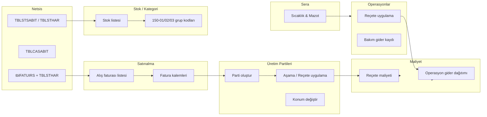

# Üretim2026 – FidanX Üretim Süreç Planı

**Tarih:** 23 Şubat 2026  
**Proje:** Botanik Bahçe Yönetim Sistemi (FidanX + Netsis ERP)  
**Kapsam:** Satınalma → Stok → Reçete → Üretim (Partiler) → Sera → Operasyon → Maliyet → Raporlama uçtan uca akışının netleştirilmesi.

---

## 1. Genel Veri Akışı

Yüksek seviyede veri akışı:

---

## 2. Adım Adım Süreçler

### 2.1 Satınalma

- **Kaynak:** Netsis alış faturaları (`GET /netsis/invoices?faturaTuru=2&pageSize=500`)
- **Ekran:** `client/app/satinalma/page.tsx`

Adımlar:

1. **Fatura Listesi**
   - Tüm alış faturaları Netsis’ten okunur.
   - Tab’lar: 150-01, 150-02, 150-03, DIGER, HIZ, TÜMÜ
   - Kategori, faturadaki ilk kalemin stok kodu / grup kodundan gelir.

2. **Fatura Detayı**
   - `GET /netsis/invoices/:belgeNo/details?cariKodu=...`
   - Kalem mapping’i:
     - `StokAdi` → `name`
     - `Miktar` → `amount`
     - `Birim` → `unit`
     - `BirimFiyat` → `unitPrice`
     - `StokKodu` → `materialId`

3. **Satınalma Faturası Kayıt (Lokal)**
   - Bekliyor durumunda: kalem ekle/düzenle/sil serbest.
   - Kaydedildiğinde `Purchases` + `PurchaseItems` tablolarına yazılır (maliyet analizinde kullanılmak üzere).

4. **Saksı Kararı**
   - İlk alış faturasında saksı alanı **zorunlu değil**.
   - Saksı boyutu ileride parti oluştururken veya reçete ile belirlenecek.

---

### 2.2 Stok

- **Kaynak:** `GET /netsis/stocks/list` + `TBLSTGRUP` (grup kodları)
- **Ekran:** `client/app/stoklar/page.tsx`

Adımlar:

1. **Stok Kategorileri**
   - 150-01: Bitki fidanları (her tür için tek stok kartı)
   - 150-02: Saksı / ambalaj
   - 150-03: Hammadde (torf, gübre, ilaç)

2. **Filtreler**
   - Kategori: Grup adı / koduna göre.
   - Tedarikçi: Netsis alış faturalarından JOIN ile.
   - Stok/Cari: Cari adı + stok adına göre.

3. **Stok Miktarı**
   - Tamamen Netsis’ten (`TBLSTHAR`) okunur.
   - FidanX tarafında stok miktarı tutulmaz; sadece parti miktarları ve maliyetler takip edilir.

---

### 2.3 Reçete

- **Kaynak:** `Recipes`, `RecipeItems` tabloları.
- **Ekran:** `client/app/receteler/page.tsx`

Adımlar:

1. Bitki türüne göre reçeteler:
   - Hangi saksı (150-02 stokları),
   - Hangi toprak/torf (150-03 stokları),
   - Hangi gübre/ilaçlar (150-03 stokları),
   - Miktarlar (adet veya kg/litre).

2. Reçete maliyeti:
   - `recipes.service.ts` içindeki hesaplama ile, reçete × adet başına malzeme maliyeti hesaplanır.

---

### 2.4 Üretim (Partiler)

- **Tablolar:** `ProductionBatches`, `ProductionHistory`, `ProductionCostHistory`
- **Backend:** `production/production.service.ts`
- **Ekranlar:** `client/app/uretim/page.tsx`, `client/app/uretim/[id]/page.tsx`

Adımlar:

1. **Parti Oluşturma**
   - Kaynak stok: Netsis stok kartı (150-01).
   - Form:
     - LotId (otomatik veya kullanıcı girişi),
     - Bitki adı,
     - Miktar,
     - Başlangıç tarihi,
     - Konum (Ayarlardaki `locations`),
     - Opsiyonel reçete (varsa başlangıçta stok düşümü + maliyet).

2. **Aşama Güncelleme**
   - Ayarlardaki “Üretim Safhaları (Dinamik Şaşırtma)” listesinden:
     - Örn: TEPSİ → KÜÇÜK_SAKSI → BÜYÜK_SAKSI → SATIŞA_HAZIR
   - Eğer reçete seçilirse:
     - Stok uygunluk kontrolü (`checkStockAvailability`),
     - Reçete maliyet hesaplama,
     - `ProductionBatches.AccumulatedCost` güncelleme,
     - `ProductionCostHistory` kaydı ekleme,
     - Stok düşümü (`deductMaterials`).

3. **Konum Değiştirme (Transfer)**
   - Konumlar: Ayarlardaki `locations` (Sera 1, Sera 2, Açık Alan, Depo…).
   - Transfer:
     - `ProductionBatches.Location` güncellenir,
     - `ProductionHistory` içine “Konum Değişimi: …” kaydı yazılır,
     - `Activity` log’unda özetlenir.

4. **Parti Detay Ekranı (`/uretim/[id]`)**
   - Backend: `GET /production/batches/:id?tenantId=...`
   - Gösterilenler:
     - Parti temel bilgileri (bitki, konum, miktar),
     - Maliyet özeti (toplam ve birim),
     - Geçmiş (ProductionHistory),
     - Maliyet geçmişi (ProductionCostHistory).

---

### 2.5 Sera (Sıcaklık / Mazot)

- **Tablo:** `TemperatureLogs`
- **Backend:** `production/temperature.service.ts`
- **Ekranlar:** `client/app/sera/page.tsx`, `client/app/raporlar/page.tsx`, `client/app/page.tsx` (dashboard sıcaklık kartı)

Adımlar:

1. Günlük/haftalık sıcaklık kayıt formu:
   - Tarih,
   - Sera içi: sabah/öğle/akşam,
   - Sera dışı: sabah/öğle/akşam,
   - Mazot tüketimi,
   - Not.

2. Raporlama:
   - Zaman serisi grafikler,
   - Konum bazlı değerlere gelecekte bağlanma (Ayarlardaki konumlarla).

3. Dashboard entegrasyonu:
   - `GET /production/temperature-logs?tenantId=...` ile son N kayıt okunur,
   - Özet kart ve basit grafik gösterilir.

---

### 2.6 Günlük Operasyonlar

- **Tablolar:** `ActivityLogs`, `Recipes`, `Expenses`, `ProductionBatches`
- **Ekran:** `client/app/operasyon/page.tsx` (veya ilgili sayfa)

Adımlar:

1. **Reçete Uygulama**
   - Hedef konum(lar) seçilir (bir veya birden fazla sera/bölge),
   - Reçete seçilir,
   - Uygulama tarihi girilir,
   - Maliyet:
     - Reçete toplam maliyeti hesaplanır,
     - Seçili konumlardaki partilere miktarlarına göre **orantılı** dağıtılır,
     - `ProductionCostHistory`’ye ek kayıtlar oluşturulur.

2. **Bakım Gideri (Genel Giderler)**
   - Örn: İşçilik, enerji, bakım, nakliye…
   - Konum(lar) seçilir,
   - Toplam gider tutarı girilir,
   - `distributeOperationCost` ile bu gider seçili konumlardaki partilere:
     - Toplam miktar üzerinden birim maliyet hesaplanarak dağıtılır.

3. **Fire / Kayıp**
   - İleride: Partiden belirli adet düşülerek fire kaydı eklenir,
   - Birim maliyet korunur, toplam maliyet azalan miktara bölündüğü için artar.

---

### 2.7 Maliyet

- **Temel Formül:**

> Birim Maliyet = Toplam Birikmeli Maliyet / Mevcut Canlı Bitki Sayısı

Kaynaklar:

- Alış maliyeti (Netsis faturaları),
- Reçete uygulamaları (malzeme maliyeti),
- Operasyon giderleri (işçilik, enerji vb.),
- İleri aşamada: nakliye, genel gider.

Maliyet verisi:

- `ProductionBatches.AccumulatedCost`,
- `ProductionCostHistory` (ayrıntılı kalem bazlı).

---

### 2.8 Raporlama

Öngörülen raporlar:

- Parti bazlı maliyet raporu (toplam, birim, kalem bazlı),
- Sera/konum bazlı verimlilik (maliyet + adet + satış),
- Müşteri bazlı kârlılık (satış fiyatı – maliyet),
- Gider dağılımı (tür, konum, dönem bazında).

---

## 3. Gelecek Geliştirmeler (Üretim Tarafı)

Bu bölüm henüz uygulanmamış ama planlanan geliştirmeleri içerir:

1. **Şaşırtma Modülü**
   - Parti bölme (örnek: 2000 adetten 500 adeti başka safhaya almak),
   - Her şaşırtmada otomatik saksı + toprak maliyeti ekleme,
   - Stok düşümü ve maliyet artışı.

2. **Barkod / QR Entegrasyonu**
   - Her parti veya saksı için barkod üretme,
   - Scanner sayfasında barkod okutunca parti/bitki geçmişini getirme.

3. **Netsis Serbest Üretim Entegrasyonu**
   - Üretim bitişlerinde Netsis’e serbest üretim hareketi yazma,
   - ERP ile stok/maliyet tam uyum.

4. **Bitki Şeceresi (Genealogy)**
   - Bir bitkinin tüm yaşam döngüsünü (alımdan satışa) tek ekranda gösterme.

---

## 4. Bugün İçin Özet (2026-02-23)

- Satınalma tarafındaki A1–A3 geliştirmeleri projede aktif.
- Parti detay ekranı gerçek API ile çalışıyor.
- Üretim süreç akışı bu dokümanda netleştirildi.
- Gelecek adım: Üretim modülündeki şaşırtma, barkod ve Netsis’e yazma entegrasyonlarını bu plana göre adım adım uygulamak.

